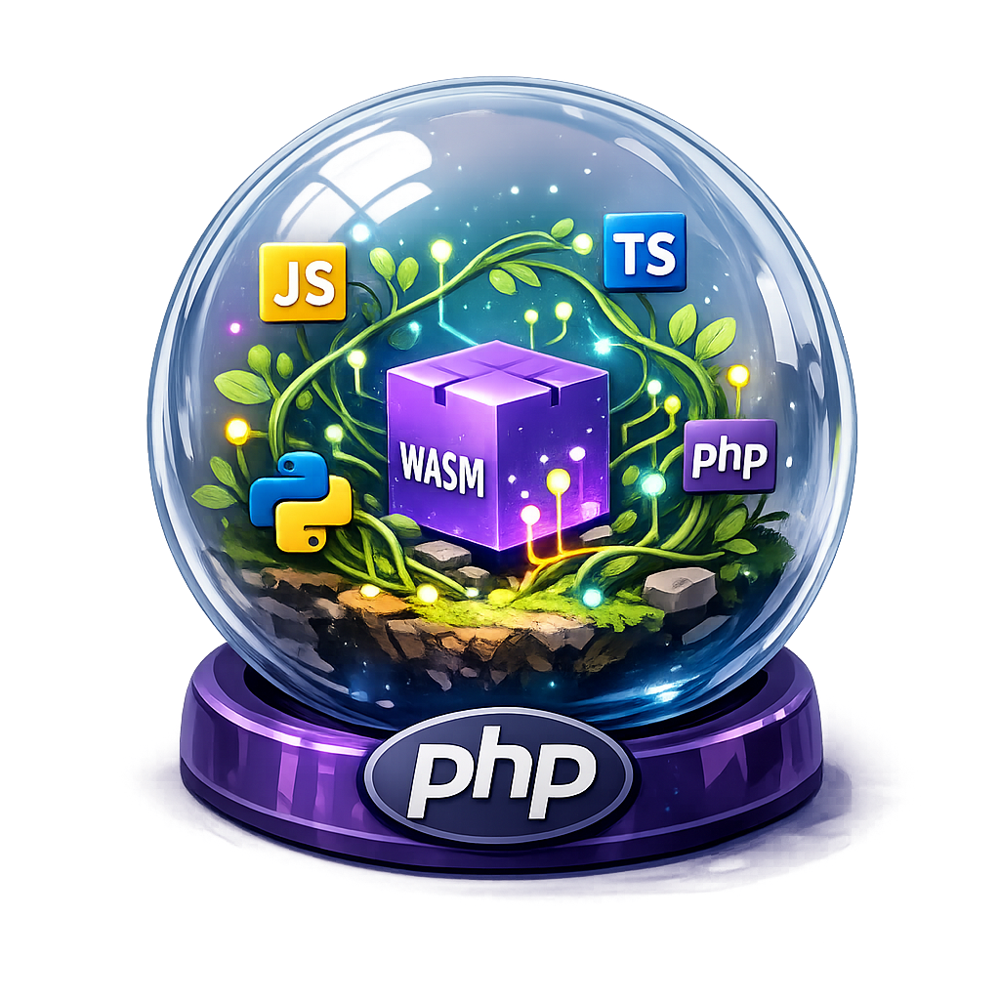

<p align="center">
  
</p>

# Terrarium

Run untrusted **JavaScript, TypeScript, Python, or PHP inside PHP** — sandboxed in
WebAssembly, against a typed capability SDK you define in plain PHP.

You write capabilities as ordinary typed PHP functions and `register()` them;
untrusted guest code runs inside a WebAssembly sandbox and calls them **by name**
as a typed API. The guest reaches exactly what you registered — nothing else — and
because its entire language engine runs *inside* the WASM boundary, even a
memory-corruption bug in that engine cannot touch your process. **No containers,
no microVMs: one PHP extension.**

The whole thing is **one uniform API** — a single `Terrarium` class. The guest's
language is decided purely by which `*_guest.wasm` you load; nothing else changes.

## Features

- **Language-agnostic guests** — JavaScript ([QuickJS](guests/quickjs/README.md)
  or [Boa](guests/boa/README.md)), [Python](guests/rustpython/README.md),
  [PHP](guests/php/README.md), [TypeScript](guests/typescript/README.md); anything
  that targets WASM behind a tiny contract.
- **Capability allowlist** — the guest sees only the PHP functions you register,
  reached by their dotted names (no synthetic root). That allowlist is the entire
  trust boundary.
- **In-process memory isolation** — the engine runs *inside* the WASM sandbox, so
  an engine bug stays contained without an outer microVM/container.
- **TypeScript checked in-sandbox** — the real `tsc` runs in the guest and checks
  every eval against the `.d.ts` of your registered SDK, before it runs.
- **Typed SDK, three languages** — types inferred from your PHP signatures +
  PHPDoc and emitted as `.d.ts`, `.pyi`, or a `.php` stub.
- **Typed exceptions + captured output** — guest failures surface as a
  `Terrarium\Exception` family; `console.log`/`print` is captured separately and
  survives a throw.
- **Bounded and optionally deterministic** — memory, time, stack, and fuel limits;
  fuel gives reproducible runs.

## Quick example

```php
require 'lib/Terrarium.php';   // or, via Composer: require 'vendor/autoload.php';

use Terrarium\Terrarium;

$wasm = new Terrarium('tests/wasm/quickjs_guest.wasm', timeoutMs: 500, memoryLimit: 32 << 20);

// Your SDK is plain, typed PHP — the signature is the schema.
$wasm->register('user.fetch',
    /**
     * Fetch a user by ID.
     * @return array{name: string, roles: string[]}
     */
    fn (int $id): array => ['name' => 'Ada', 'roles' => ['admin', 'dev']]);

// Untrusted guest code runs sandboxed and calls the SDK by its registered name.
echo $wasm->eval('user.fetch(42).roles.length');   // => 2

echo $wasm->types('dts');   // a typed .d.ts of the SDK ('pyi' for Python, 'php' for a PHP guest)
```

Swap `quickjs_guest.wasm` for `boa_guest.wasm`, `rustpython_guest.wasm`, or
`php_guest.wasm` and the host code is unchanged. Fuller programs — typed
capabilities, four languages over one SDK — in [`examples/`](examples).

## TypeScript, checked inside the sandbox

Load `typescript_guest.wasm` and every eval is **type-checked against the `.d.ts`
generated from your registered SDK** before it runs — the real TypeScript compiler
executes inside the wasm guest:

```php
use Terrarium\Terrarium;

$ts = new Terrarium('tests/wasm/typescript_guest.wasm');
$ts->register('user.fetch',
    /** @return array{name: string, roles: string[]} */
    fn (int $id): array => ['name' => 'Ada', 'roles' => ['admin', 'dev']]);

$ts->eval('user.fetch("42")');
// => Terrarium\GuestException: TS2345: Argument of type 'string' is not
//    assignable to parameter of type 'number'. (line 1) — nothing executed

$ts->eval('const u = user.fetch(42); `${u.name}: ${u.roles.join(", ")}`');
// => "Ada: admin, dev"
```

There's also a lint-style mode — `check()` validates **without running** and
returns *every* diagnostic as data (`[]` = passed). It works on every guest at the
depth its language allows (a full type-check here; a syntax/compile check on the
JS, Python, and PHP guests). See [docs/api.md](docs/api.md).

## Installation

Prebuilt binaries are attached to each
[release](https://github.com/eddmann/terrarium/releases) for PHP 8.4 / 8.5 —
self-hosted Linux, AWS Lambda (a ready Bref layer), and macOS (Apple Silicon) —
plus the platform-independent PHP library and guest wasm. Enable the extension and
point the facade at a guest:

```ini
; php.ini
extension=/path/to/terrarium-...so
```

Then pull the PHP library (the `Terrarium\Terrarium` facade + type inference) via
Composer, and grab a guest engine from the `guests.zip` release artifact:

```sh
composer require eddmann/terrarium
```

The package requires `ext-terrarium`, so Composer errors clearly if the extension
binary isn't enabled.

Or build from source (Rust 1.96+, clang, PHP dev headers — a plain cargo
`cdylib`, no `phpize`; the guest fixtures are committed, so no wasm toolchain is
needed):

```sh
git clone https://github.com/eddmann/terrarium && cd terrarium
make build      # -> target/debug/libterrarium.{so,dylib}
make test       # Rust unit tests + the PHP suites
```

→ Full matrix, Docker, and AWS Lambda / Bref instructions: **[docs/install.md](docs/install.md)**.

## How it works

```
PHP (trusted)  ──ext-php-rs──►  Rust bridge  ──wasmtime──►  WASM guest (untrusted)
   register()                  dispatch table                a real language engine
   eval()                      host_call(name, bytes)        SDK names as globals
```

1. **PHP defines the SDK.** `register()` typed PHP closures (and `grant()` live
   objects as opaque handles). That allowlist is the entire trust boundary.
2. **The guest runs sandboxed in WASM.** A real engine compiled to wasm runs your
   source and sees the SDK as frozen, multi-level globals installed from the
   registered names — contained by memory / CPU / time limits and zero ambient
   authority. Values cross as MessagePack over linear memory through one
   `host_call` import.
3. **Types flow to the guest author.** The SDK's types are *inferred from the PHP
   signatures* (Reflection + PHPDoc, incl. nested `array{…}` shapes) and emitted as
   `.d.ts`, `.pyi`, or a `.php` stub.

→ **[docs/architecture.md](docs/architecture.md)** for the full design.

## The engines

Five are bundled; the same bridge serves any language that targets WASM. Each
guest pins the upstream version it tracks; the committed fixtures are built from
these. See each guest's README for build details and internals.

- [**QuickJS-ng**](guests/quickjs/README.md) `v0.15.1` — JavaScript, C via the
  WASI SDK (the reference guest).
- [**Boa**](guests/boa/README.md) `0.20` — JavaScript, pure Rust (no C toolchain).
- [**RustPython**](guests/rustpython/README.md) `0.5` — Python, pure Rust.
- [**PHP**](guests/php/README.md) `8.3.14` — real php-src via its embed SAPI:
  sandboxed PHP *inside* PHP.
- [**TypeScript**](guests/typescript/README.md) — QuickJS-ng + `tsc` `5.7.3` as
  bytecode; type-checked against the SDK, erased, and run — Wizer-snapshotted so a
  checked eval is ~20 ms warm.

## Scope

Terrarium's boundary is the WebAssembly VM, in-process. Unlike embedding an engine
natively, a memory-corruption bug **inside the guest engine is contained** — it
cannot form a pointer outside its linear memory or call a syscall you didn't
import. The capability model contains *what the guest can reach*; the resource
limits contain *abuse* (infinite loops, alloc bombs); and the VM contains *the
engine itself*. That's a stronger default than a natively-embedded interpreter,
with no outer microVM/gVisor required for memory safety.

The honest residual: a bug in **Wasmtime itself** is in the trust base — but that's
a small, Rust, memory-safe, heavily-fuzzed surface, a far better bet than trusting
each bundled engine's C codebase.

## Documentation

- [Installation](docs/install.md) — the three pieces, prebuilt binaries, AWS
  Lambda (Bref), and building from source.
- [API reference](docs/api.md) — the `Terrarium` class and every method.
- [Architecture](docs/architecture.md) — why WebAssembly, the capability bridge
  and `host_call` ABI, marshaling, type inference, and the trust model.
- [Execution modes](docs/execution-modes.md) — shared vs. isolated instances.
- [Errors](docs/errors.md) — the exception family, the `$error` sentinel, and
  output capture.
- Per-engine notes under [`guests/`](guests).

## License

[MIT](LICENSE). The committed guest fixtures (`tests/wasm/*.wasm`) embed
third-party engines under their own licenses — see
[THIRD_PARTY_LICENSES.md](THIRD_PARTY_LICENSES.md).
